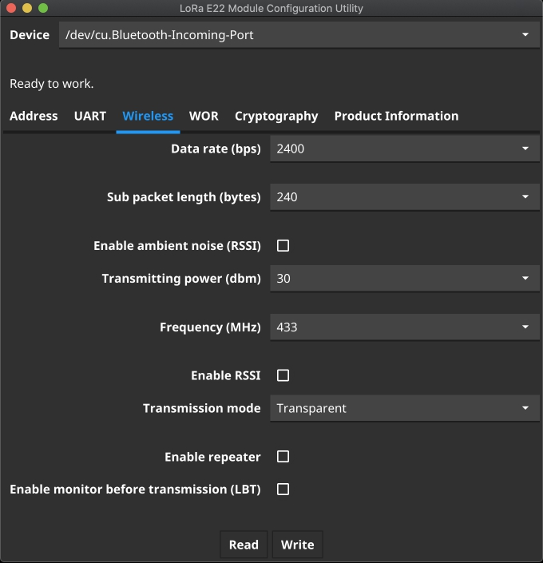

# e22config
EBYTE E22/E31/E32 Module Configuration Utility

Tested with MacOS Catalina, Windows 7

each module support was added as separate branch

module | power | chip | branch
------------ | ------------ | ------------- | -------------
E22-400T30D | 1W | Semtech SX1262 | main
E22-400T33D | 2W | Semtech SX1262 | e22-33
E31-433T33D | 2W | Axem AX5243 | e31
E32-433T30D | 1W | Semtech SX1278 | e32
E32-433T33D | 2W | Semtech SX1278 | e32-33

